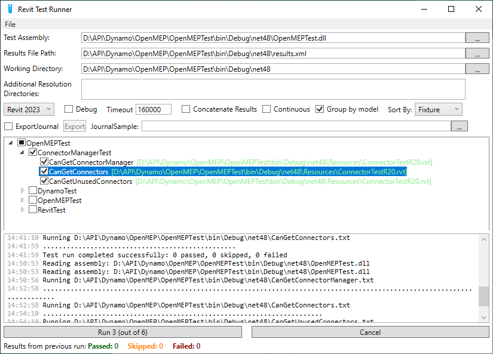

## Contributing

#### Contributions are more than welcome! Please work in the dev branch to do so:

- Create or update your own fork of OpenMEP under your GitHub account.
- Checkout to the ``dev`` branch.
- In the dev branch, implement and test you changes specific to the feature.
- Build the project and make sure everything works.
- Create well-documented commits of your changes.
- Submit a pull request to the origin:dev branch.

#### Build

Debugging:

- Run **Debug Profile** in Visual Studio or **Run Configuration** in JetBrains Rider. The required files have been
  added. All project files will be automatically copied to the Revit plugins folder.

Creating a package:

- Open the terminal of your IDE.
- Install Nuke global tools `dotnet tool install Nuke.GlobalTool --global`.
- Run `nuke` command.
- The generated package will be in the **output** folder.

---

### Documentation and comments

- Document your code write with English language and use [DocFx](https://dotnet.github.io/docfx/) to
  generate the documentation. Please use branch.
  **docs** to collaborate with the documentation.
- Build Local Command :  
  - Open terminal of your IDE.
  - Command : `docfx docs/docfx.json --serve`
  - Open browser and go to `http://localhost:8080/`
- Update Docfx : dotnet tool update -g docfx
### Unit tests

- The [Revit Test Framework](https://github.com/DynamoDS/RevitTestFramework) (RTF) allows for remote testing on Revit.
  RTF creates a journal file for running Revit, specifies a model for it to open, and a specific test or fixture of
  tests to run. A model can also be specified to open before testing to run several tests with.
- Write unit tests for your code. Please use branch **dev** to collaborate with the tests and write them in the
  **OpenMEPTest** project.

#### Please avoid:

- Lots of unrelated changes in one commit.
- Modifying files that are not directly related to the feature you implement.
