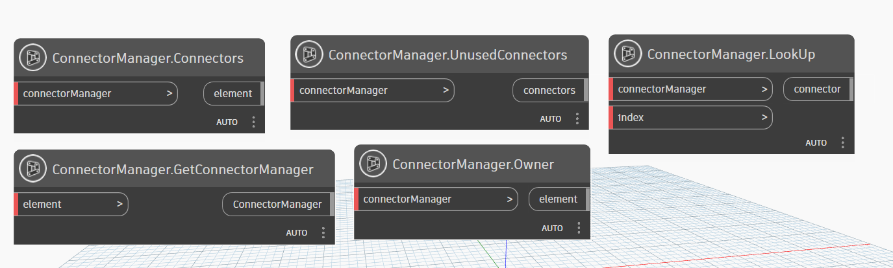

# ConnectorManager

```{tableofcontents}
```



```{contents}
```

## GetConnectorManager

```xml
/// <summary>
/// return connector manager of element
/// </summary>
/// <param name="element">element</param>
/// <returns name="ConnectorManager">ConnectorManager</returns>
```


## UnusedConnectors

```xml
/// <summary>
/// return UnusedConnectors from connector manager
/// </summary>
/// <param name="connectorManager">connector manager</param>
/// <returns name="connectors">connectors</returns>
```


## Owner

```xml
/// <summary>
///  property is used to retrieve the owner of the Connector Manager. 
/// </summary>
/// <param name="connectorManager"></param>
/// <returns name="element">element owner</returns>
```


## Connectors

```xml
/// <summary>
/// Return all the Connectors of the Connector Manager. 
/// </summary>
/// <param name="connectorManager">connector manager</param>
/// <returns name="connectors">a collections of connector manager</returns>
```


## LookUp

```xml
/// <summary>
/// return connector by index 
/// </summary>
/// <param name="connectorManager">connector manager</param>
/// <param name="index">index of connector</param>
/// <returns name="connector">connector</returns>
```

