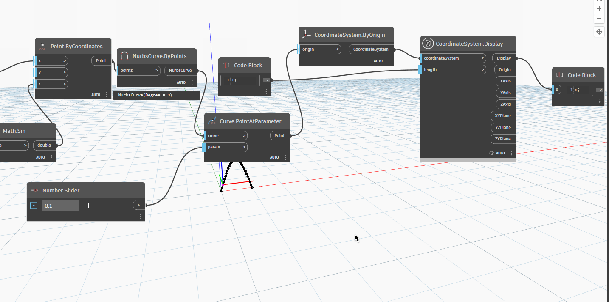

# Coordinate System

## Display

```xml
/// <summary>
/// Shows scalable lines representing the CoordinateSystem axes and rectangles for the planes
/// </summary>
/// <param name="coordinateSystem">Autodesk.DesignScript.Geometry.CoordinateSystem</param>
/// <param name="length">double</param>
/// <returns name="Display">GeometryColor</returns>
/// <returns name="Origin">Point</returns>
/// <returns name="XAxis">Vector</returns>
/// <returns name="YAxis">Vector</returns>
/// <returns name="ZAxis">Vector</returns>
/// <returns name="XYPlane">Plane</returns>
/// <returns name="YZPlane">Plane</returns>
/// <returns name="ZXPlane">Plane</returns>
```



[Display.dyn](https://github.com/chuongmep/OpenMEP/blob/dev/docs/OpenMEPPage/geometry/dyn/CoordinateSystem.Display.dyn)