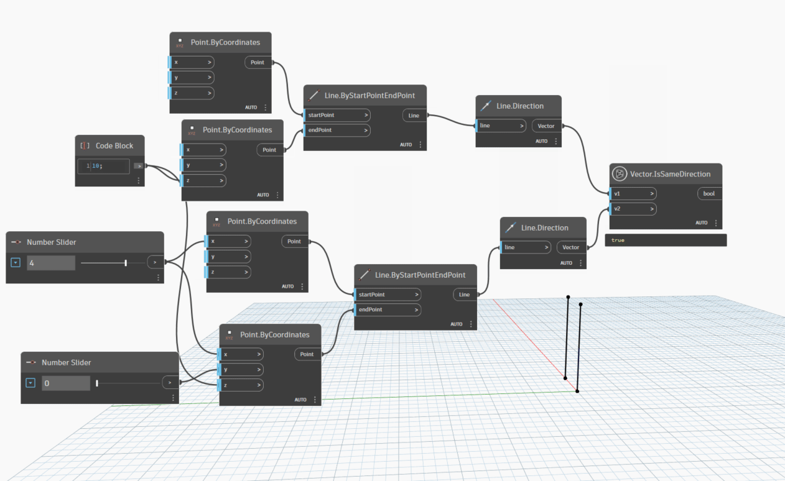
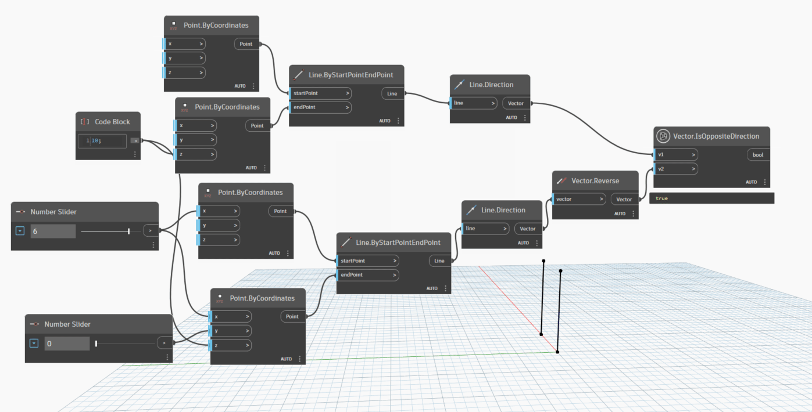

# Vector

```{contents}
```

## IsSameDirection

```xml
/// <summary>
/// Check whether two vector is same direction or not
/// </summary>
/// <param name="v1">the first vector</param>
/// <param name="v2">the second vector</param>
/// <returns name="bool">true if two vector is same direction</returns>
```



[IsSameDirection.dyn](https://github.com/chuongmep/OpenMEP/blob/dev/docs/OpenMEPPage/geometry/dyn/Vector.IsSameDirection.dyn)

## IsOppositeDirection

```xml
/// <summary>
/// Check two Vector is opposite direction or not
/// </summary>
/// <param name="v1">the first vector</param>
/// <param name="v2">the second vector</param>
/// <returns name="bool">true if two vector is opposite</returns>
```



[IsOppositeDirection.dyn](https://github.com/chuongmep/OpenMEP/blob/dev/docs/OpenMEPPage/geometry/dyn/Vector.IsOppositeDirection.dyn)

## Display

```xml
/// <summary>
/// Shows a scalable line representing a Vector from a chosen starting point
/// </summary>
/// <param name="vector">Autodesk.DesignScript.Geometry.Vector</param>
/// <param name="startPoint">Autodesk.DesignScript.Geometry.Point</param>
/// <param name="scale">value scale start from 1</param>
/// <returns name="Display">GeometryColor</returns>
/// <returns name="X">double</returns>
/// <returns name="Y">double</returns>
/// <returns name="Z">double</returns>
/// <returns name="Length">double</returns>

```


[Display.dyn](https://github.com/chuongmep/OpenMEP/blob/dev/docs/OpenMEPPage/geometry/dyn/Vector.Display.dyn)