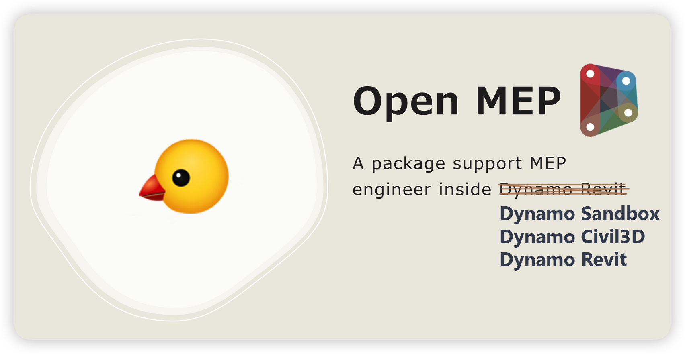

# Open MEP

 

 

   

# 📚 Description

OpenMEP Package also includes a comprehensive library of MEP components, making it easy to select and incorporate the
right components into your design.This library includes a wide range of mechanical, electrical, and plumbing components,
including pipes, fittings, valves, ducts, electrical equipment, and more fully automate your design process in design,
maintenance, calculation and analysis,...

I believe that the MEP Package will be a valuable asset to construction professionals looking to streamline the MEP
design process and ensure that their projects are completed on time and within budget.

# 🍴 Installation

The package installer is available on the [Open MEP Release](https://github.com/chuongmep/OpenMEP/releases/latest). You
can install it from there.

- OpenMEP now Support Dynamo **[Revit](https://www.autodesk.com.sg/products/revit/overview)** Version : 2020, 2021, 2022 , 2023, 2024 , 2025
- OpenMEP now Support Dynamo **[Sandbox](https://dynamobuilds.com/)** Version : 2.3, 2.6, 2.12, 2.13 2.16, 2.17 , 3.0
- OpenMEP now Support Dynamo **[Civil3D](https://www.autodesk.com.sg/products/civil-3d/overview)** Version : 2020, 2021, 2022 , 2023, 2024, 2025

Read more about [Installation](https://chuongmep.github.io/OpenMEP/articles/installation.html)

# 📜 Documentation

- [API Documentation](https://chuongmep.github.io/OpenMEP/api/OpenMEPRevit.Element.CableTray.html)
- [How To Use OpenMEP Package](https://chuongmep.github.io/OpenMEP/index.html)
- [How To Write Python Script With OpenMEP Package](https://chuongmep.github.io/OpenMEP/articles/python.html)

# 🦚 Features

Some features of this package:
- [x] Integrated with CAD anywhere with Dynamo Revit, Dynamo Sandbox.
- [x] Connect Eco Software with Dynamo like Dynamo Sandbox, Dynamo Revit, Dynamo Civil3D,.. 
- [x] Fast delivery package for MEP Engineer
- [x] Easy to use and interactive with Dynamo Revit
- [x] Easy to collaborate with other engineer
- [x] Easy to report bug
- [x] Easy to maintain, support multiple version of Dynamo Revit
- [x] Easy install, update, uninstall
- [x] Revit Database Explore - Easy to explore Revit Database use [RevitDBExplorer](https://github.com/NeVeSpl/RevitDBExplorer)
# © Copyright

This package is licensed under the [MIT License](LICENSE.md).
The MIT License is a permissive open-source software license that allows for the use, modification, and distribution of
software, both commercially and non-commercially, with the only requirement being that the original copyright and
license notice be included with any distribution. It is a popular choice among developers for its simplicity and
permissiveness.

A part of Geometry Display Dependency is licensed under the [Miscellany Package](https://github.com/thomascorrie/Miscellany) under AGPL-3.0.

A part of this library depend on [LunchBox Package](https://bitbucket.org/provingground-io/lunchbox-for-dynamo/src/master/) under  [https://www.gnu.org/licenses/lgpl-3.0.en.html](https://www.gnu.org/licenses/lgpl-3.0.en.html).

# ⛑️ Sponsors
- This package is sponsored by [Jetbrains](https://www.jetbrains.com/?from=OpenMEP), the best IDE for C# and Python
  developer.
- Chicken icon made by [icons8.com](https://icons8.com/)

# 🐛 Issues

Now, I accept all idea and all issue, contribute from all people all the word.
You can make suggestions or track and submit bugs via [OpenMEP](https://github.com/chuongmep/OpenMEP/issues) issues. You
can submit your own code to the Open MEP
project via a Github pull [request](https://github.com/chuongmep/OpenMEP/pulls).

- Discuss In
  Forum : [Open MEP Package Feedback Thread](https://forum.dynamobim.com/t/openmep-package-feedback-thread/86350)

# 👥 Contributing

I have a lot of ideas for this package, but I don't have enough time to implement them. If you want to contribute,
please read guideline [here](CONTRIBUTING.md).

Many Thanks all contributors for this repository. Feel free to contribute!
Please refer to the [CONTRIBUTING](CONTRIBUTING.md) for details.

# Dependencies

- This package use [NUnit](https://nunit.org/) for test framework.
- The [Revit Test Framework](https://github.com/DynamoDS/RevitTestFramework) (RTF) allows for remote testing on Revit.
  RTF creates a journal file for running Revit, specifies a model for it to open, and a specific test or fixture of
  tests to run. A model can also be specified to open before testing to run several tests with.
- This package use [G-Shark](https://github.com/GSharker/G-Shark) - A free and open-source geometry library designed for
  computational designers and software developers in the Architecture, Engineering, and Construction (AEC) industry.

# 🔓 Open Source Recommend

Some project I recommend for you
at [Dynamo Open Source](https://chuongmep.github.io/Awesome-Dynamo/DynamoOpenSource/dynopensource.html)

# 🙋‍♂️ Frequently Asked Questions

Why this package not published on Dynamo Package Manager ?

It not support way I maintain with multiple version and release CI/CD with Dynamo Revit.

Can I use this package with Dynamo Sandbox ?

Just one of part library generic supported with Dynamo Sandbox.

Can I write Python Script with OpenMEP Package ?

Yes, you can write Python Script with OpenMEP Package. You can read more
about [How To Write Python Script With OpenMEP](https://github.com/chuongmep/OpenMEP/wiki/How-To-Write-Python-Script-With-OpenMEP-Package)

What is MEPCurve ?

**[MEPCurve](https://www.revitapidocs.com/2015/38714847-0f40-7021-aa79-2884c3a02ce2.htm)** is a curve object for duct or
pipe blend elements, it mean input require **Duct** or **Pipe** or **Cable Tray** element.

