# Connector


```{contents}
```

## Radius

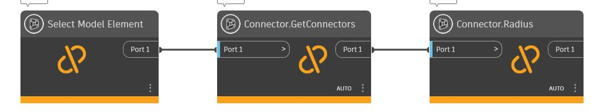
## GetConnectorClosest

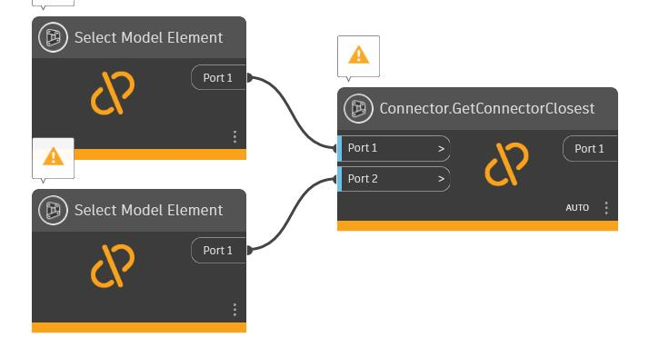
## GetConnectorSet


## GetConnectorFarthest

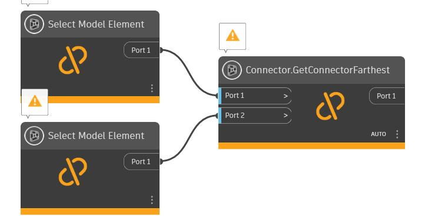
## GetConnectors


## GetUnusedConnectors

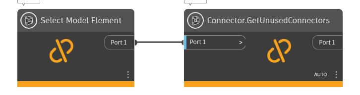
## SystemType


## Direction

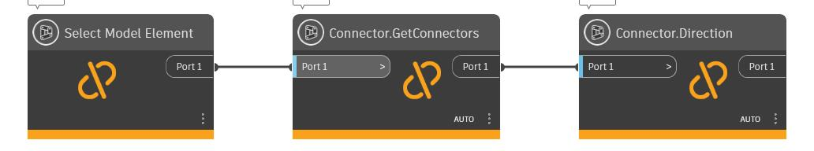
## Origin


## IsConnected


## DistanceTo


## Owner


## Id


## Angle

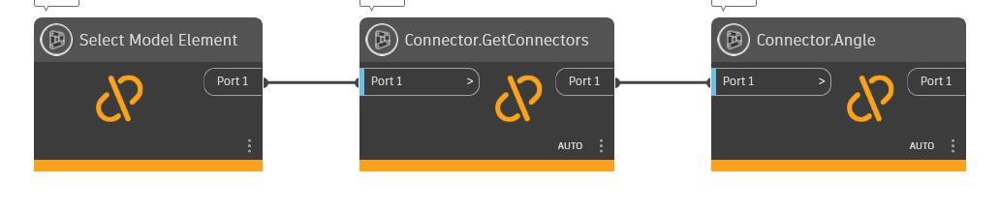

## Coefficient


## Demand


## Flow

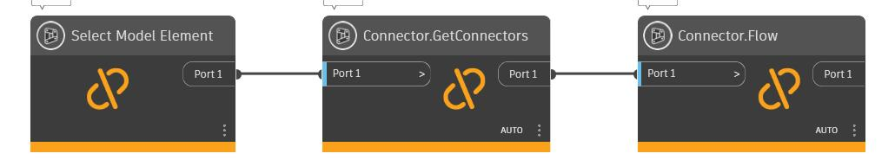
## Height


## Width

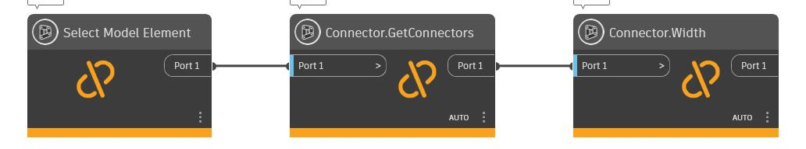
## AssignedFlow

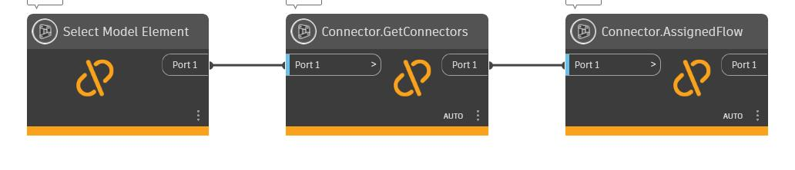
## EngagementLength

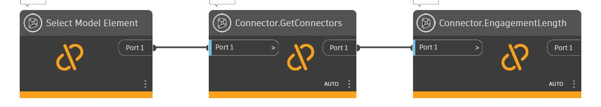
## PressureDrop

## AllRefs

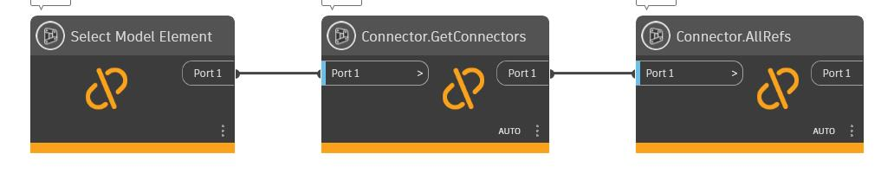
## Domain


## VelocityPressure

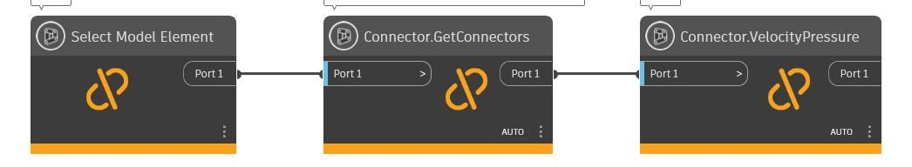
## AssignedFixtureUnits

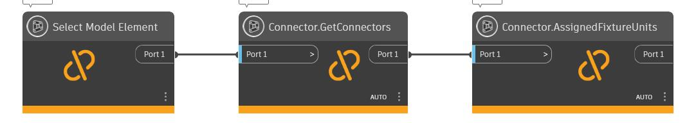
## AssignedFlowFactor

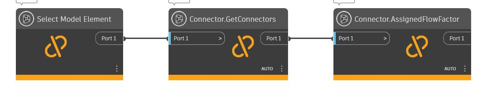
## AssignedKCoefficient

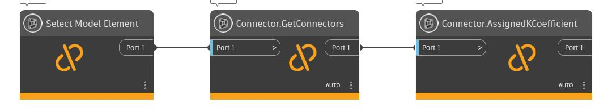

## GetElementConnectedWith


## AssignedLossCoefficient


## AssignedPressureDrop

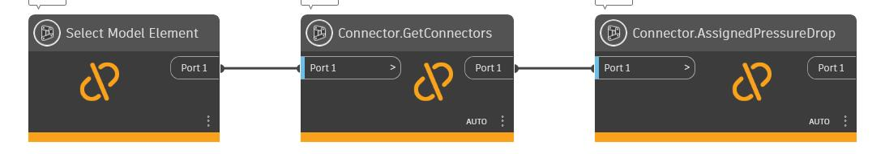

## Description

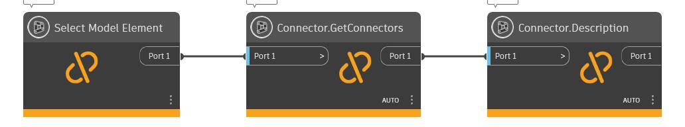
## Shape

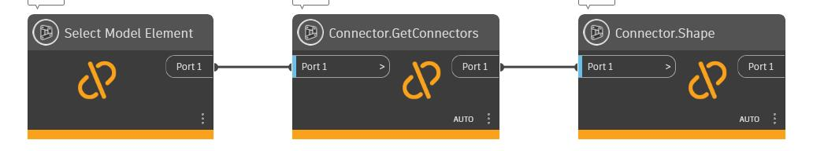
## CoordinateSystem

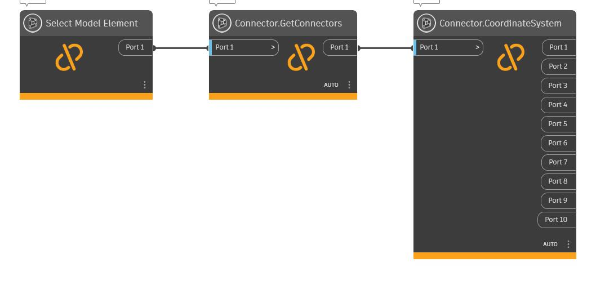
## ConnectorManager


## GetArea


## GetMEPConnectorInfo

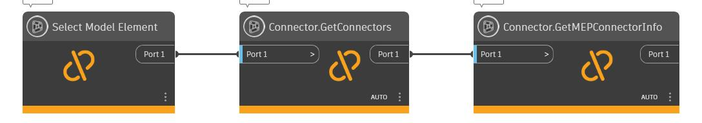
## SetAngle

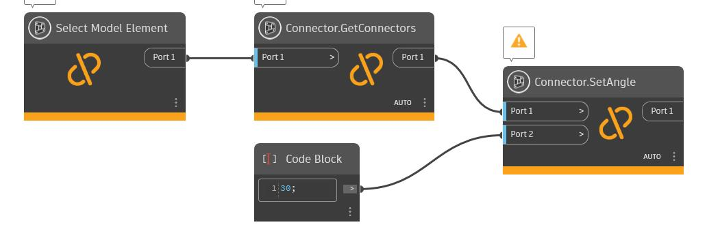
## SetOrigin

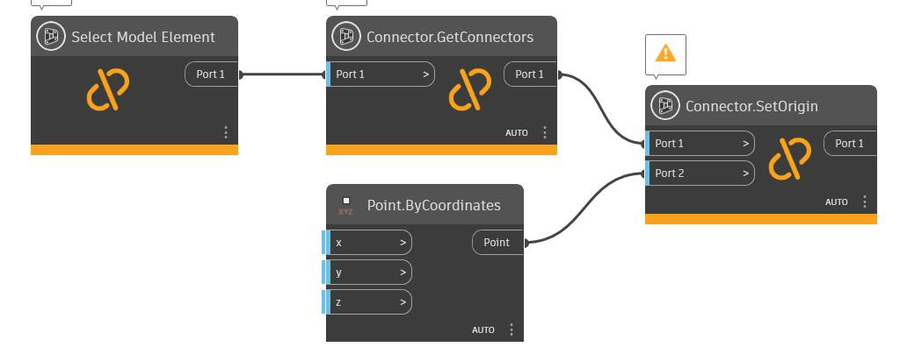
## DisConnectFrom


## ConnectTo

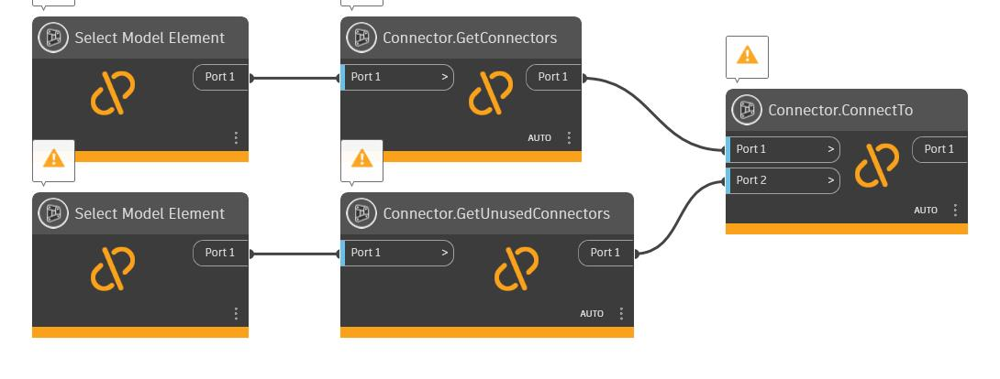