# Connector

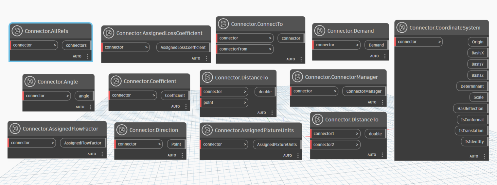

```{contents}
```

## Radius

```xml
/// <summary>
/// return the radius of connector
/// </summary>
/// <param name="connector">connector</param>
/// <returns name="radius">radius</returns>
```

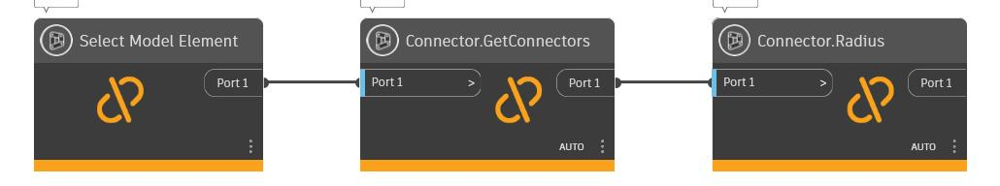

[Connector.Radius.dyn](https://github.com/chuongmep/OpenMEP/blob/dev/docs/OpenMEPPage/connectormanager/dyn/Connector.Radius.dyn)

## GetConnectorClosest

```xml
/// <summary>
///  Return Connector Closet With Connector Current
/// </summary>
/// <param name="point">origin</param>
/// <param name="connectors">list connector to check</param>
/// <returns name="connector">connector</returns>
```


[Connector.GetConnectorClosest.dyn](https://github.com/chuongmep/OpenMEP/blob/dev/docs/OpenMEPPage/connectormanager/dyn/Connector.GetConnectorClosest.dyn)
## GetConnectorSet

```xml
/// <summary>
/// return connector set of element
/// </summary>
/// <param name="element"></param>
/// <returns></returns>
```
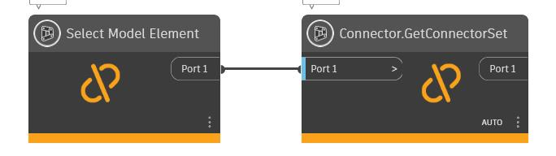

[Connector.GetConnectorSet.dyn](https://github.com/chuongmep/OpenMEP/blob/dev/docs/OpenMEPPage/connectormanager/dyn/Connector.GetConnectorSet.dyn)
## GetConnectorFarthest

```xml
/// <summary>
/// return connector farthest with point current
/// </summary>
/// <param name="point"></param>
/// <param name="connectors"></param>
/// <returns></returns>
```


[Connector.GetConnectorFarthest.dyn](https://github.com/chuongmep/OpenMEP/blob/dev/docs/OpenMEPPage/connectormanager/dyn/Connector.GetConnectorFarthest.dyn)

## GetConnectors

```xml
/// <summary>
/// return list connector from connector manager
/// </summary>
/// <param name="connectorManager">connector manager</param>
/// <returns name="connectors">connectors</returns>
```


[Connector.GetConnectors.dyn](https://github.com/chuongmep/OpenMEP/blob/dev/docs/OpenMEPPage/connectormanager/dyn/Connector.GetConnectors.dyn)

## GetUnusedConnectors

```xml
/// <summary>
/// return list connector from element
/// </summary>
/// <param name="element">element</param>
/// <returns name="connectors">connectors</returns>
```

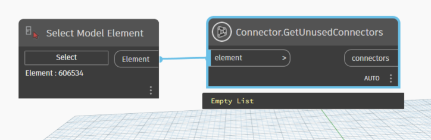

[Connector.GetUnusedConnectors.dyn](https://github.com/chuongmep/OpenMEP/blob/dev/docs/OpenMEPPage/connectormanager/dyn/Connector.GetUnusedConnectors.dyn)
## SystemType

```xml
/// <summary>
/// return system type of connector
/// </summary>
/// <param name="connector">connector</param>
/// <returns name="domain">domain</returns>
```


[Connector.SystemType.dyn](https://github.com/chuongmep/OpenMEP/blob/dev/docs/OpenMEPPage/connectormanager/dyn/Connector.SystemType.dyn)

## Direction

```xml
/// <summary>
    /// Get direction of connector
    /// </summary>
    /// <param name="connector"></param>
    /// <returns></returns>
```

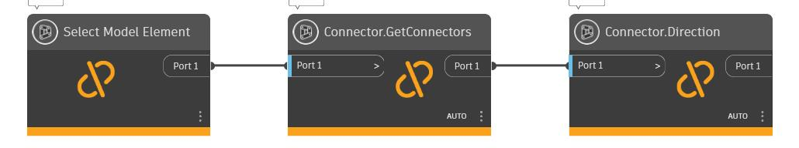

[Connector.Direction.dyn](https://github.com/chuongmep/OpenMEP/blob/dev/docs/OpenMEPPage/connectormanager/dyn/Connector.Direction.dyn)

## Origin

```xml
/// <summary>
/// Get origin of connector
/// </summary>
/// <param name="connector">the connector</param>
/// <returns name="point">location origin of connector</returns>
```

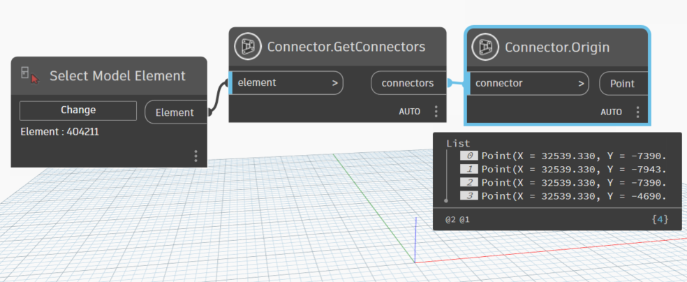

[Connector.Origin.dyn](https://github.com/chuongmep/OpenMEP/blob/dev/docs/OpenMEPPage/connectormanager/dyn/Connector.Origin.dyn)
## IsConnected

```xml
/// <summary>
/// check connector is connected or not
/// </summary>
/// <param name="connector">the connector</param>
/// <returns name="bool">true if connector is connected</returns>
```

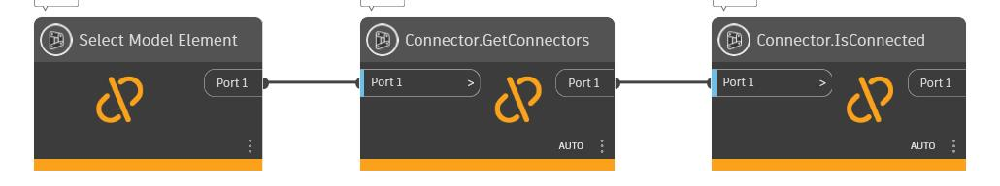

[Connector.IsConnected.dyn](https://github.com/chuongmep/OpenMEP/blob/dev/docs/OpenMEPPage/connectormanager/dyn/Connector.IsConnected.dyn)

## DistanceTo

```xml
/// <summary>
/// return distance between one connector with another point
/// </summary>
/// <param name="connector">the connector</param>
/// <param name="point">point to get distance from this to the connector</param>
/// <returns name="double">distance from connector to point</returns>
```

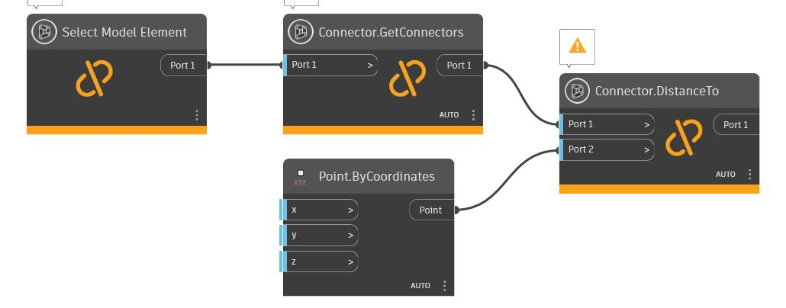

[Connector.DistanceTo.dyn](https://github.com/chuongmep/OpenMEP/blob/dev/docs/OpenMEPPage/connectormanager/dyn/Connector.DistanceTo.dyn)

## Owner

```xml
/// <summary>
/// The host of the connector.
/// The element that contains  connector. It may also contain other connectors.
/// </summary>
/// <param name="connector">connector</param>
/// <returns name="element">element</returns>
```

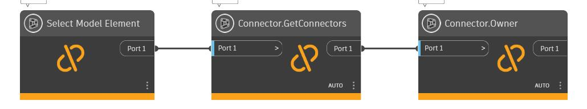

[Connector.Owner.dyn](https://github.com/chuongmep/OpenMEP/blob/dev/docs/OpenMEPPage/connectormanager/dyn/Connector.Owner.dyn)

## Id

```xml
/// <summary>
/// return id of connector
/// </summary>
/// <param name="connector">connector</param>
/// <returns name="double">Id of connector</returns>
```

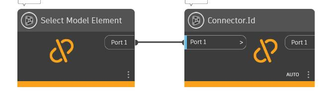

[Connector.Id.dyn](https://github.com/chuongmep/OpenMEP/blob/dev/docs/OpenMEPPage/connectormanager/dyn/Connector.Id.dyn)

## Angle

```xml
/// <summary>
/// return angle of connector
/// </summary>
/// <param name="connector">connector</param>
/// <returns name="double">angle</returns>
```

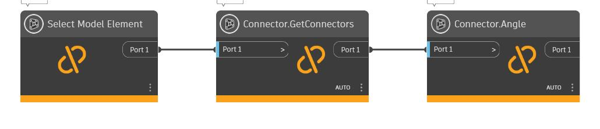

[Connector.Angle.dyn](https://github.com/chuongmep/OpenMEP/blob/dev/docs/OpenMEPPage/connectormanager/dyn/Connector.Angle.dyn)

## Coefficient

```xml
/// <summary>
/// The coefficient of the connector.
/// </summary>
/// <param name="connector">Connector</param>
/// <returns name="double">Coefficient</returns>
```

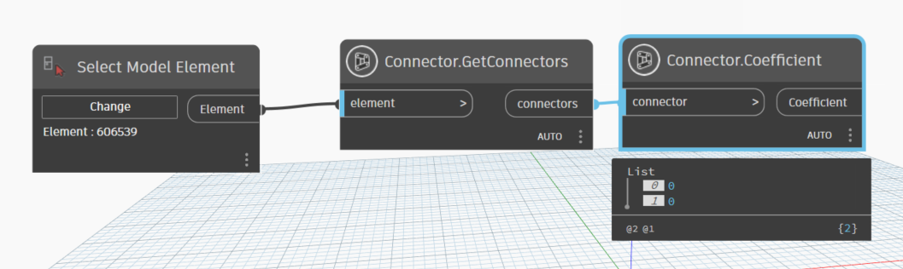

[Connector.Coefficient.dyn](https://github.com/chuongmep/OpenMEP/blob/dev/docs/OpenMEPPage/connectormanager/dyn/Connector.Coefficient.dyn)

## Demand

```xml
/// <summary>
/// The demand of the connector.
/// </summary>
/// <param name="connector">Connector</param>
/// <returns name="double">Demand</returns>
```

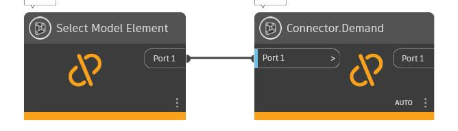

[Connector.Demand.dyn](https://github.com/chuongmep/OpenMEP/blob/dev/docs/OpenMEPPage/connectormanager/dyn/Connector.Demand.dyn)
## Flow

```xml
/// <summary>
/// The Flow of the connector.
/// </summary>
/// <param name="connector">Connector</param>
/// <returns name="double">Flow of connector</returns>
```


[Connector.Flow.dyn](https://github.com/chuongmep/OpenMEP/blob/dev/docs/OpenMEPPage/connectormanager/dyn/Connector.Flow.dyn)

## Height

```xml
/// <summary>
/// The height of the connector.
/// </summary>
/// <param name="connector">Connector</param>
/// <returns name="double">Height</returns>
```

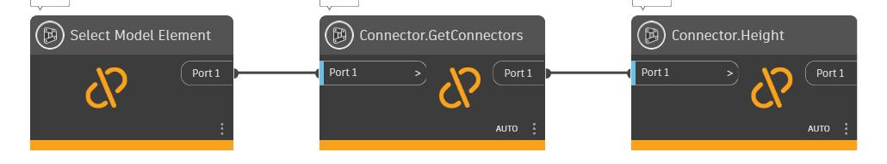

[Connector.Height.dyn](https://github.com/chuongmep/OpenMEP/blob/dev/docs/OpenMEPPage/connectormanager/dyn/Connector.Height.dyn)

## Width

```xml
/// <summary>
/// The Width of the connector.
/// </summary>
/// <param name="connector">Connector</param>
/// <returns name="double">the width of connector</returns>
```


[Connector.Width.dyn](https://github.com/chuongmep/OpenMEP/blob/dev/docs/OpenMEPPage/connectormanager/dyn/Connector.Width.dyn)
## AssignedFlow

```xml
/// <summary>
/// The assigned flow of the connector.
/// </summary>
/// <param name="connector">Connector</param>
/// <returns name="double">AssignedFlow</returns>
```

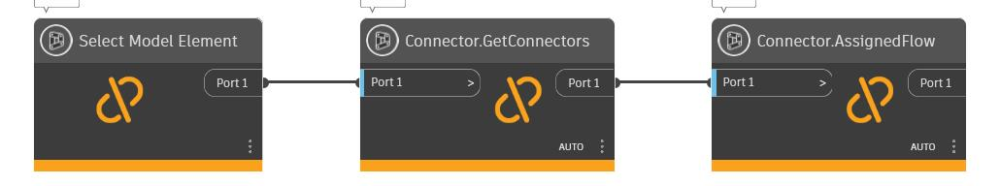

[Connector.AssignedFlow.dyn](https://github.com/chuongmep/OpenMEP/blob/dev/docs/OpenMEPPage/connectormanager/dyn/Connector.AssignedFlow.dyn)
## EngagementLength

```xml
/// <summary>
/// Connector engagement length
/// </summary>
/// <param name="connector">Connector</param>
/// <returns name="double">Connector engagement length</returns>
```


[Connector.EngagementLength.dyn](https://github.com/chuongmep/OpenMEP/blob/dev/docs/OpenMEPPage/connectormanager/dyn/Connector.EngagementLength.dyn)
## PressureDrop

```xml
/// <summary>
/// The pressure drop of the connector.
/// </summary>
/// <param name="connector">Connector</param>
/// <returns name="double">PressureDrop</returns>
```
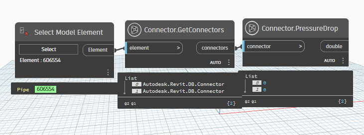

[Connector.PressureDrop.dyn](https://github.com/chuongmep/OpenMEP/blob/dev/docs/OpenMEPPage/connectormanager/dyn/Connector.PressureDrop.dyn)

## AllRefs

```xml
/// <summary>
/// All references of the connector.
/// </summary>
/// <param name="connector">connector</param>
/// <returns name="connectors">A set of connectors that the connectors is connected to, including both physical connection and logical connection.</returns>
```

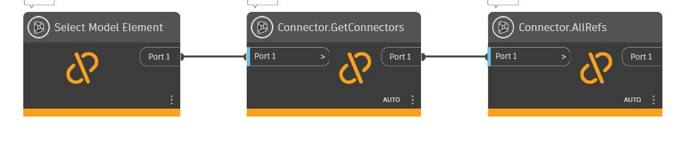

[Connector.AllRefs.dyn](https://github.com/chuongmep/OpenMEP/blob/dev/docs/OpenMEPPage/connectormanager/dyn/Connector.AllRefs.dyn)

## Domain

```xml
/// <summary>
/// The domain of the connector.
/// </summary>
/// <param name="connector">Connector</param>
/// <returns name="Autodesk.Revit.DB.Domain">Domain</returns>
```


[Connector.Domain.dyn](https://github.com/chuongmep/OpenMEP/blob/dev/docs/OpenMEPPage/connectormanager/dyn/Connector.Domain.dyn)

## VelocityPressure

```xml
/// <summary>
/// The velocity pressure of the connector.
/// </summary>
/// <param name="connector">Connector</param>
/// <returns name="double">VelocityPressure</returns>
```

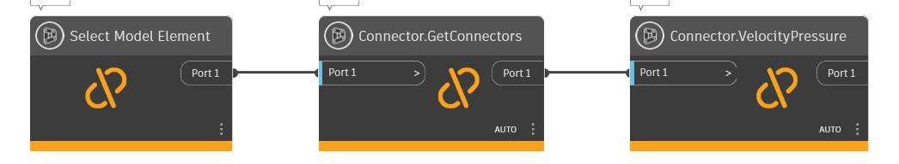

[Connector.VelocityPressure.dyn](https://github.com/chuongmep/OpenMEP/blob/dev/docs/OpenMEPPage/connectormanager/dyn/Connector.VelocityPressure.dyn)
## AssignedFixtureUnits

```xml
/// <summary>
/// The assigned fixture units of the connector.
/// </summary>
/// <param name="connector">Connector</param>
/// <returns name="double">AssignedFixtureUnits</returns>
```

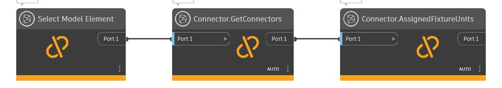

[Connector.AssignedFixtureUnits.dyn](https://github.com/chuongmep/OpenMEP/blob/dev/docs/OpenMEPPage/connectormanager/dyn/Connector.AssignedFixtureUnits.dyn)

## AssignedFlowFactor

```xml
/// <summary>
/// The assigned flow factor of  connector.
/// </summary>
/// <param name="connector">Connector</param>
/// <returns name="double">AssignedFlowFactor</returns>
```

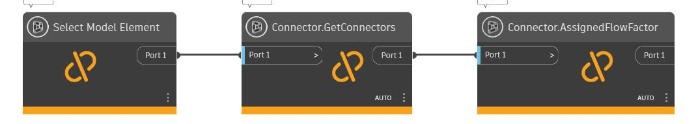

[Connector.AssignedFlowFactor.dyn](https://github.com/chuongmep/OpenMEP/blob/dev/docs/OpenMEPPage/connectormanager/dyn/Connector.AssignedFlowFactor.dyn)
## AssignedKCoefficient

```xml
/// <summary>
/// The assigned kCoefficient of the connector.
/// </summary>
/// <param name="connector">Connector</param>
/// <returns name="double">AssignedKCoefficient</returns>
```


[Connector.AssignedKCoefficient.dyn](https://github.com/chuongmep/OpenMEP/blob/dev/docs/OpenMEPPage/connectormanager/dyn/Connector.AssignedKCoefficient.dyn)

## GetElementConnectedWith

```xml
/// <summary>
/// return element connected with  connector
/// </summary>
/// <param name="connector">connector</param>
/// <returns name="element">element has connected with connector</returns>
```

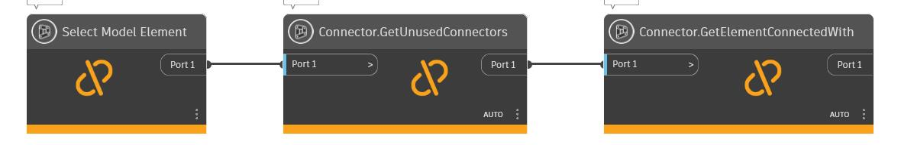

[Connector.GetElementConnectedWith.dyn](https://github.com/chuongmep/OpenMEP/blob/dev/docs/OpenMEPPage/connectormanager/dyn/Connector.GetElementConnectedWith.dyn)

## AssignedLossCoefficient

```xml
/// <summary>
/// The assigned loss coefficient of the connector.
/// </summary>
/// <param name="connector">Connector</param>
/// <returns name="double">AssignedLossCoefficient</returns>
```


[Connector.AssignedKCoefficient.dyn](https://github.com/chuongmep/OpenMEP/blob/dev/docs/OpenMEPPage/connectormanager/dyn/Connector.AssignedKCoefficient.dyn)

## AssignedPressureDrop

```xml
/// <summary>
/// The assigned pressure drop of the connector.
/// </summary>
/// <param name="connector">Connector</param>
/// <returns name="double">AssignedPressureDrop</returns>
```

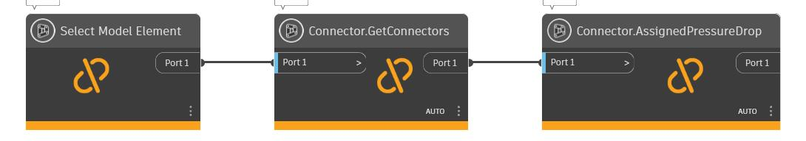

[Connector.AssignedPressureDrop.dyn](https://github.com/chuongmep/OpenMEP/blob/dev/docs/OpenMEPPage/connectormanager/dyn/Connector.AssignedPressureDrop.dyn)

## Description

```xml
/// <summary>
/// The description of the connector.
/// </summary>
/// <param name="connector">Connector</param>
/// <returns name="string">Description</returns>
```
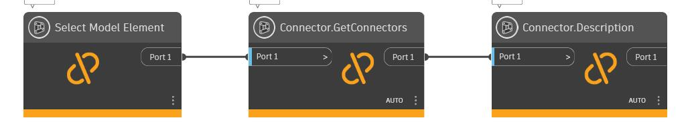

[Connector.Description.dyn](https://github.com/chuongmep/OpenMEP/blob/dev/docs/OpenMEPPage/connectormanager/dyn/Connector.Description.dyn)

## Shape

```xml
/// <summary>
/// The shape of the connector.
/// </summary>
/// <param name="connector">Connector</param>
/// <returns name="ConnectorProfileType">ConnectorProfileType</returns>
```


[Connector.Shape.dyn](https://github.com/chuongmep/OpenMEP/blob/dev/docs/OpenMEPPage/connectormanager/dyn/Connector.Shape.dyn)

## CoordinateSystem

```xml
/// <summary>
/// Return CoordinateSystem of the connector.
/// </summary>
/// <param name="connector"></param>
/// <returns></returns>
```

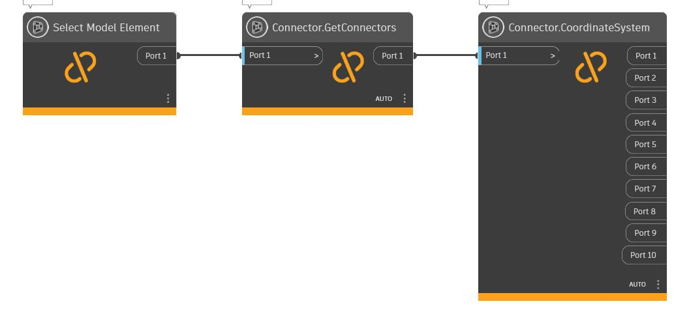

[Connector.CoordinateSystem.dyn](https://github.com/chuongmep/OpenMEP/blob/dev/docs/OpenMEPPage/connectormanager/dyn/Connector.CoordinateSystem.dyn)
## ConnectorManager

```xml
/// <summary>
/// The connector manager of the connector.
/// </summary>
/// <param name="connector">Connector</param>
/// <returns name="ConnectorManager">ConnectorManager</returns>

```
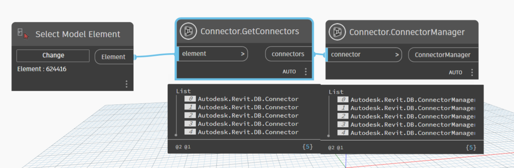

[Connector.ConnectorManager.dyn](https://github.com/chuongmep/OpenMEP/blob/dev/docs/OpenMEPPage/connectormanager/dyn/Connector.ConnectorManager.dyn)

## GetArea

```xml
/// <summary>
/// Get area of connector
/// </summary>
/// <param name="connector">connector</param>
/// <returns name="double">area of connector</returns>
```


[Connector.GetArea.dyn](https://github.com/chuongmep/OpenMEP/blob/dev/docs/OpenMEPPage/connectormanager/dyn/Connector.GetArea.dyn)
## GetMEPConnectorInfo

```xml
/// <summary>
/// Gets MEP connector information.
/// </summary>
/// <param name="connector">Connector</param>
/// <returns name="MEPConnectorInfo">Returns null if there is no MEP connector information associated</returns>
```


[Connector.GetMEPConnectorInfo.dyn](https://github.com/chuongmep/OpenMEP/blob/dev/docs/OpenMEPPage/connectormanager/dyn/Connector.GetMEPConnectorInfo.dyn)

## SetAngle

```xml
/// <summary>
/// set new angle for connector
/// </summary>
/// <param name="connector">connector</param>
/// <param name="angle">angle</param>
```

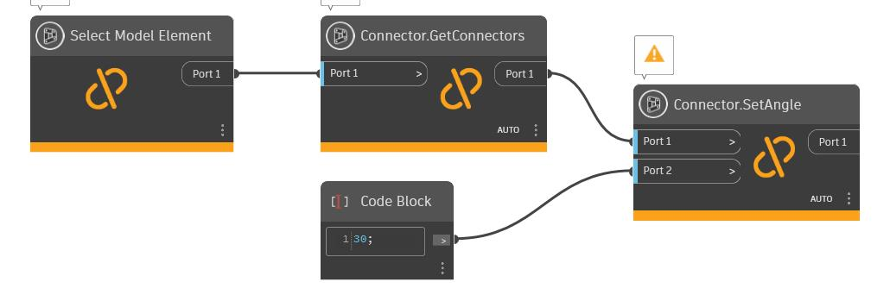

[Connector.SetAngle.dyn](https://github.com/chuongmep/OpenMEP/blob/dev/docs/OpenMEPPage/connectormanager/dyn/Connector.SetAngle.dyn)

## SetOrigin

```xml
/// <summary>
/// set new origin for connector
/// </summary>
/// <param name="connector">connector</param>
/// <param name="origin">new point</param>
```


[Connector.SetOrigin.dyn](https://github.com/chuongmep/OpenMEP/blob/dev/docs/OpenMEPPage/connectormanager/dyn/Connector.SetOrigin.dyn)

## DisConnectFrom

```xml
/// <summary>
/// Remove connection between two connectors.
/// </summary>
/// <param name="connector">connect need disconnect</param>
/// <param name="connectorFrom">Indicate the connector, connection will be removed from.</param>
/// <returns name="connector">connector need disconnect</returns>
```

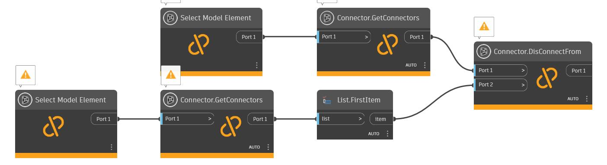

[Connector.DisConnectFrom.dyn](https://github.com/chuongmep/OpenMEP/blob/dev/docs/OpenMEPPage/connectormanager/dyn/Connector.DisConnectFrom.dyn)

## ConnectTo

```xml
/// <summary>
/// Remove connection between two connectors.
/// </summary>
/// <param name="connector">connect need connect</param>
/// <param name="connectorFrom">Indicate the connector, connection will be removed from.</param>
/// <returns name="connector">connect need connect</returns>
```


[Connector.ConnectTo.dyn](https://github.com/chuongmep/OpenMEP/blob/dev/docs/OpenMEPPage/connectormanager/dyn/Connector.ConnectTo.dyn)


## Display

```xml
/// <summary>
/// Shows scalable lines representing the CoordinateSystem of a Connector.
/// </summary>
/// <param name="connector">Autodesk.Revit.DB.Connector</param>
/// <param name="length">double</param>
/// <returns name="Display">GeometryColor order by x,y,z</returns>
/// <returns name="Origin">Point</returns>
/// <returns name="XAxis">Vector(Red color)</returns>
/// <returns name="YAxis">Vector(Green color)</returns>
/// <returns name="ZAxis">Vector(Blue color)</returns>
/// <returns name="XYPlane">Plane(Red-Green color)</returns>
/// <returns name="YZPlane">Plane(Green-Blue color)</returns>
/// <returns name="ZXPlane">Plane(Blue-Red color)</returns>
```

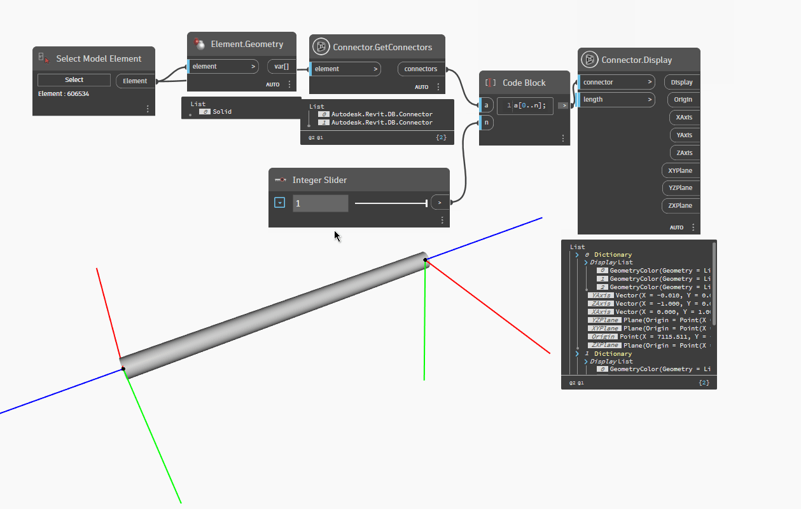
