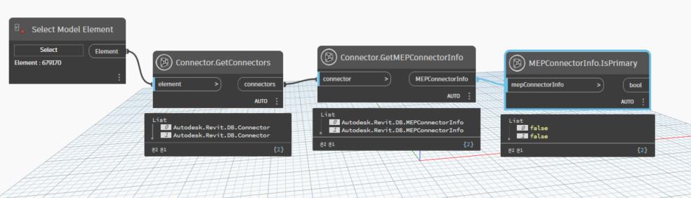
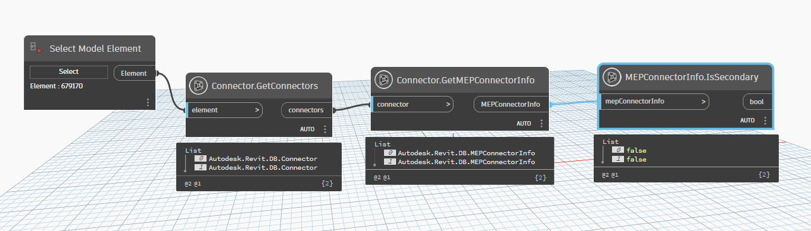
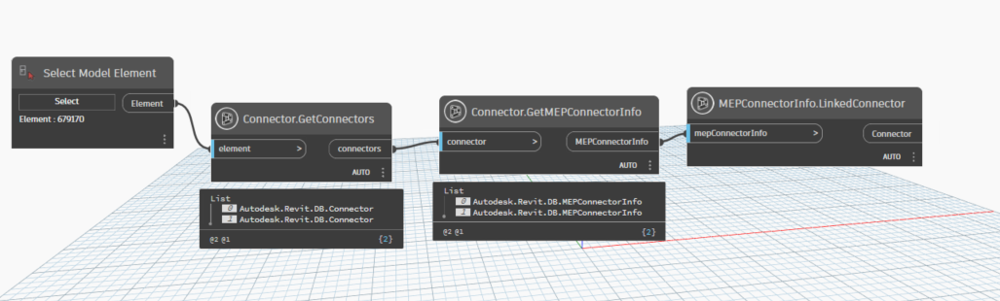

# MEP Connector Info

```{contents}
```

## IsPrimary

```xml
/// <summary>
/// True if this is the primary connector.
/// </summary>
/// <param name="mepConnectorInfo">mepConnectorInfo</param>
/// <returns name="bool">result</returns>
```



[MEPConnectorInfo.IsPrimary.dyn](https://github.com/chuongmep/OpenMEP/blob/dev/docs/OpenMEPPage/connectormanager/dyn/MEPConnectorInfo.IsPrimary.dyn)

## IsSecondary

```xml
/// <summary>
/// True if this is the secondary connector.
/// </summary>
/// <param name="mepConnectorInfo">mepConnectorInfo</param>
/// <returns name="bool">result</returns>
```



[MEPConnectorInfo.IsSecondary.dyn](https://github.com/chuongmep/OpenMEP/blob/dev/docs/OpenMEPPage/connectormanager/dyn/MEPConnectorInfo.IsSecondary.dyn)

## LinkedConnector

```xml
/// <summary>
/// The linked connector or null if there is no linked connector
/// </summary>
/// <param name="mepConnectorInfo"></param>
/// <returns name="Connector">connector</returns>
```



[MEPConnectorInfo.LinkedConnector.dyn](https://github.com/chuongmep/OpenMEP/blob/dev/docs/OpenMEPPage/connectormanager/dyn/MEPConnectorInfo.LinkedConnector.dyn)