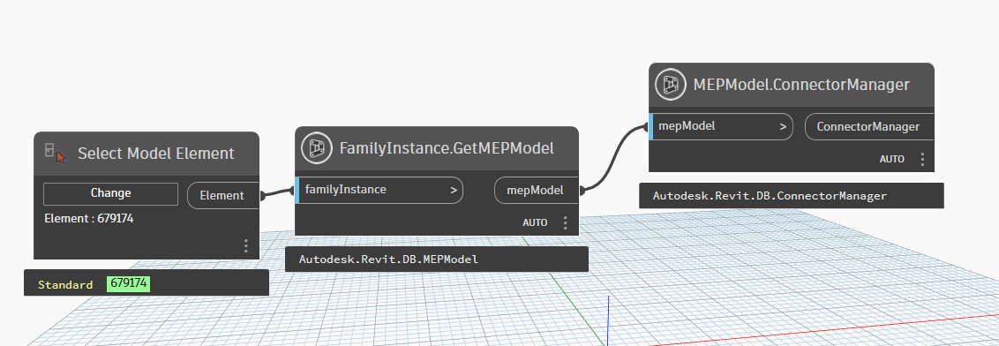
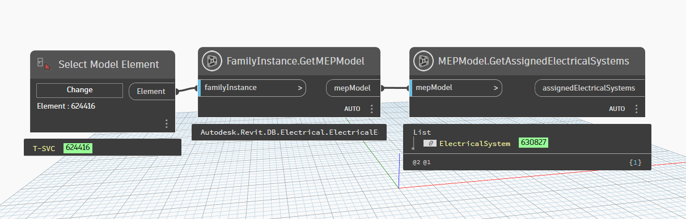
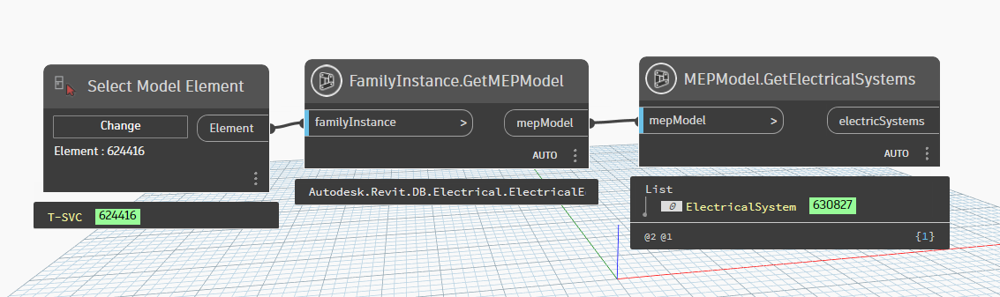
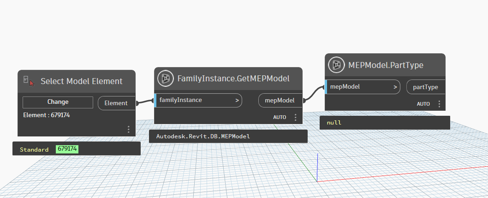

# MEPModel

```{contents}
```

## ConnectorManager

```xml
/// <summary>
/// Retrieves the Connector Manager from this MEPModel.
/// </summary>
/// <param name="mepModel">Autodesk.Revit.DB.MEPModel</param>
/// <returns name="ConnectorManager">ConnectorManager</returns>
```


[MEPModel.ConnectorManager.dyn](https://github.com/chuongmep/OpenMEP/blob/dev/docs/OpenMEPPage/connectormanager/dyn/MEPModel.ConnectorManager.dyn)

## GetAssignedElectricalSystems

```xml
/// <summary>
///    Retrieves the electrical systems this electrical panel currently is assigned to.
/// </summary>
/// <para name="mepModel">Autodesk.Revit.DB.MEPModel</para>
/// <remarks>
///    This property returns a set of Electrical Systems. If there are no electrical systems created
///    for this model, this property will be an empty set.
///    This method supersedes an older <i>AssignedElectricalSystems</i> property which has been deprecated.
/// </remarks>
/// <returns name="assignedElectricalSystems">assignedElectricalSystems</returns>
/// <since>2021</since>
```



[MEPModel.GetAssignedElectricalSystems.dyn](https://github.com/chuongmep/OpenMEP/blob/dev/docs/OpenMEPPage/connectormanager/dyn/MEPModel.GetAssignedElectricalSystems.dyn)
## GetElectricalSystems

```xml
/// <summary>
///    Retrieves the electrical systems that are currently created using this MEPModel.
/// </summary>
/// <remarks>
///    This property returns a set of Electrical Systems. If there are no electrical systems created
///    for this model, this property will be an empty set.
///    This method supersedes an older <i>ElectricalSystems</i> property which has been deprecated.
/// </remarks>
/// <para name="mepModel">Autodesk.Revit.DB.MEPModel</para>
/// <returns name="electricSystems">electricSystems</returns>
/// <since>2021</since>
```



[MEPModel.GetElectricalSystems.dyn](https://github.com/chuongmep/OpenMEP/blob/dev/docs/OpenMEPPage/connectormanager/dyn/MEPModel.GetElectricalSystems.dyn)
## PartType

```xml
/// <summary>
/// The part type of the mechanical fitting.
/// </summary>
/// <param name="mepModel">Autodesk.Revit.DB.MEPModel</param>
/// <returns name="partType">part type</returns>
```



[MEPModel.PartType.dyn](https://github.com/chuongmep/OpenMEP/blob/dev/docs/OpenMEPPage/connectormanager/dyn/MEPModel.PartType.dyn)