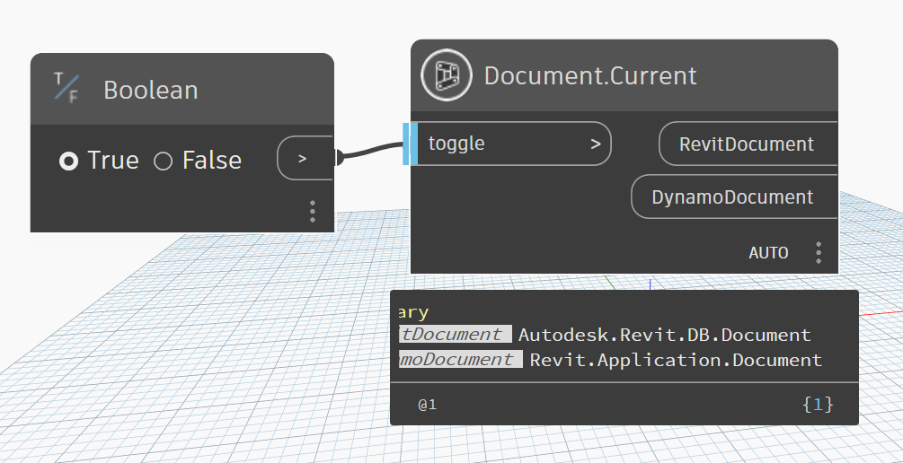

# Document

```{tableofcontents}
```

```{contents}
```

## Current

```xml
/// <summary>
/// Get Document Current
/// </summary>
/// <param name="toggle">toggle true to get current document</param>
```


[Current.dyn](https://github.com/chuongmep/OpenMEP/blob/dev/docs/OpenMEPPage/document/dyn/Document.Current.dyn)

