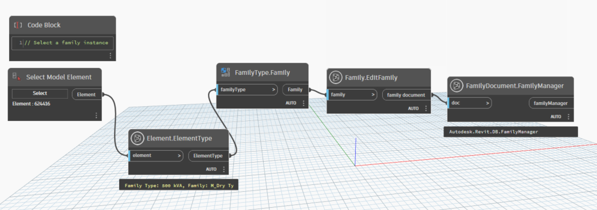

# Family Document

```{contents}
```

## FamilyManager

```xml
/// <summary>
/// The family manager object provides access to family types and parameters.
/// </summary>
/// <param name="doc">family document</param>
/// <returns name="familyManager">family manager</returns>
```



[FamilyManager.dyn](https://github.com/chuongmep/OpenMEP/blob/dev/docs/OpenMEPPage/document/dyn/FamilyDocument.FamilyManager.dyn)