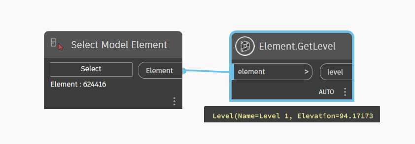

# Element

```{tableofcontents}
```

```{contents}
```

## GetLocation

```xml
/// <summary>
/// Return A Location Of Element
/// </summary>
/// <param name="element"></param>
/// <returns></returns>
```


[Element.GetLocation.dyn](https://github.com/chuongmep/OpenMEP/blob/dev/docs/OpenMEPPage/element/dyn/Element.GetLocation.dyn)

## GetDocument

```xml
/// <summary>
/// Returns the Document in which the Element resides
/// </summary>
/// <param name="element">the element</param>
/// <returns></returns>
```


[Element.GetDocument.dyn](https://github.com/chuongmep/OpenMEP/blob/dev/docs/OpenMEPPage/element/dyn/Element.GetDocument.dyn)

## MoveElement

```xml
/// <summary>
/// Move element to new location
/// </summary>
/// <param name="element">element to move</param>
/// <param name="newLocation">translate</param>
/// <returns name="element">family instance</returns>
```


[Element.MoveElement.dyn](https://github.com/chuongmep/OpenMEP/blob/dev/docs/OpenMEPPage/element/dyn/Element.MoveElement.dyn)

## GetLevel

```xml
/// <summary>
/// Return Level Of Element
/// </summary>
/// <param name="element">element to get level</param>
/// <returns name="level">level of element</returns>
```



[Element.GetLevel.dyn](https://github.com/chuongmep/OpenMEP/blob/dev/docs/OpenMEPPage/element/dyn/Element.GetLevel.dyn)