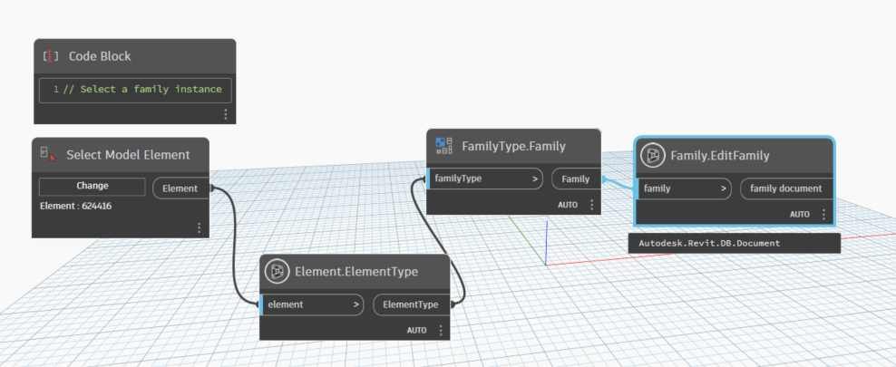

# Family

```{tableofcontents}
```

```{contents}
```

## EditFamily

```xml
/// <summary>
/// Return family document
/// </summary>
/// <param name="family">family element</param>
/// <returns name="family document">family document</returns>
```


[EditFamily.dyn](https://github.com/chuongmep/OpenMEP/blob/dev/docs/OpenMEPPage/element/family/dyn/Family.EditFamily.dyn)

## FamilyCategory

```xml
/// <summary>
/// Retrieves or sets a Category object that represents the category or sub category in which the elements ( this family could generate ) reside.
/// All category objects can be retrieved from the application by using the Categories property of the Application.Settings object.
/// </summary>
/// <param name="family">family</param>
/// <returns name="category">category</returns>
```


[FamilyCategory.dyn](https://github.com/chuongmep/OpenMEP/blob/dev/docs/OpenMEPPage/element/family/dyn/Family.FamilyCategory.dyn)

## IsOwnerFamily

```xml
/// <summary>
/// True if the family is the owner family for its own editable document, false otherwise.
/// </summary>
/// <param name="family">family</param>
/// <returns name="bool">result</returns>
```


[IsOwnerFamily.dyn](https://github.com/chuongmep/OpenMEP/blob/dev/docs/OpenMEPPage/element/family/dyn/Family.IsOwnerFamily.dyn)