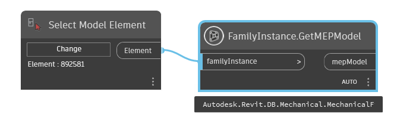

# Family Instance

## GetMEPModel

```xml
/// <summary>
/// Retrieves the MEP model for the family instance.</summary>
/// <remarks>If the family instance has a MEP model it is returned by this method, otherwise <see langword="null" /> is
/// returned. Different types of MEP model will be returned based on the type of the instance, for
/// example - if the instance is a lighting device then a lighting device model will be returned.
/// This property will only function with the Autodesk Revit MEP product.</remarks>
/// <param name="familyInstance">the element to get MepModel</param>
/// <returns name="mepModel">Autodesk.Revit.DB.MEPModel</returns>
```



[FamilyInstance.GetMEPModel.dyn](https://github.com/chuongmep/OpenMEP/blob/dev/docs/OpenMEPPage/element/dyn/FamilyInstance.GetMEPModel.dyn)
