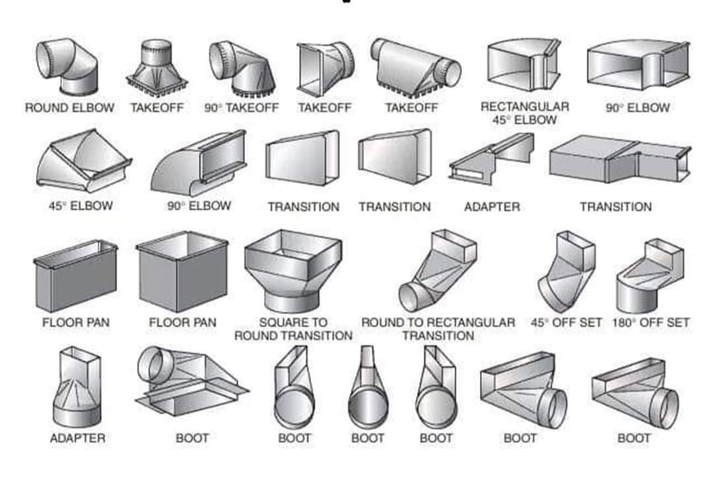
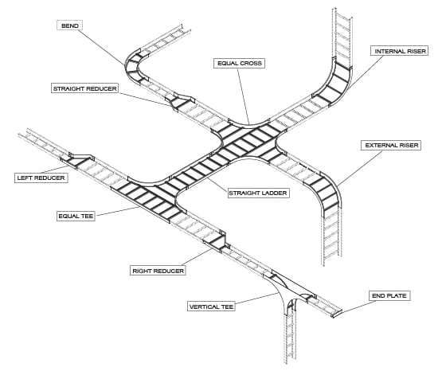

# Fitting
```{contents}
```
## Pipe Fitting

Pipe fittings are components used in piping systems to connect, control, and redirect the flow of liquids, gases, and other materials. They are used to join pipes of different sizes or shapes, change the direction of flow, regulate or control fluid pressure, and isolate or block off sections of a piping system.

Examples of pipe fittings from [kinship.io](https://kinship.io/blog/charlotte-pipe-drainage-no-hub/)


## Duct Fitting

In Autodesk Revit, a duct fitting refers to a building component used in HVAC (heating, ventilation, and air conditioning) systems to connect and redirect airflows within a building. A duct fitting is designed to connect different sections of ductwork and to redirect the airflow in different directions, such as changing the duct from a rectangular shape to a round shape or directing the airflow at a specific angle.



## Cable Tray Fitting

Cable tray fittings are components used in cable management systems to provide support, routing, and protection for electrical cables, wires, and other communication cables. Cable trays are used in a wide variety of applications, including commercial and industrial buildings, power plants, data centers, and transportation infrastructure.



## Create Cross Fitting (Duct/Pipe)


[Fitting.NewCrossFitting.dyn](https://github.com/chuongmep/OpenMEP/blob/dev/docs/OpenMEPPage/element/dyn/Fitting.NewCrossFitting.dyn)

## Create Elbow Fitting (Duct/Pipe)

## Create Take Off Fitting (Duct)

## Create Tee Fitting (Duct/Pipe)

## Create Transition Fitting (Duct/Pipe)

## Create Unions Fitting (Duct/Pipe)


