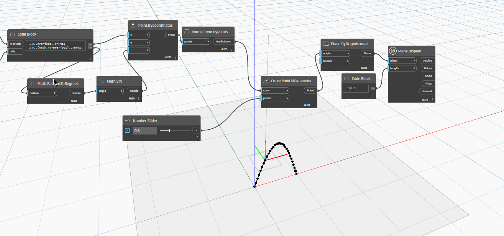

# Plane

```{contents}
```

## Display

```xml
/// <summary>
/// Shows scalable lines representing the axes and a rectangle for the Plane
/// </summary>
/// <param name="plane">Autodesk.DesignScript.Geometry.Plane</param>
/// <param name="length">double</param>
/// <returns name="Display">GeometryColor</returns>
/// <returns name="Origin">Point</returns>
/// <returns name="XAxis">Vector</returns>
/// <returns name="YAxis">Vector</returns>
/// <returns name="Normal">Vector</returns>
```


[Display.dyn](https://github.com/chuongmep/OpenMEP/blob/dev/docs/OpenMEPPage/geometry/dyn/Plane.Display.dyn)