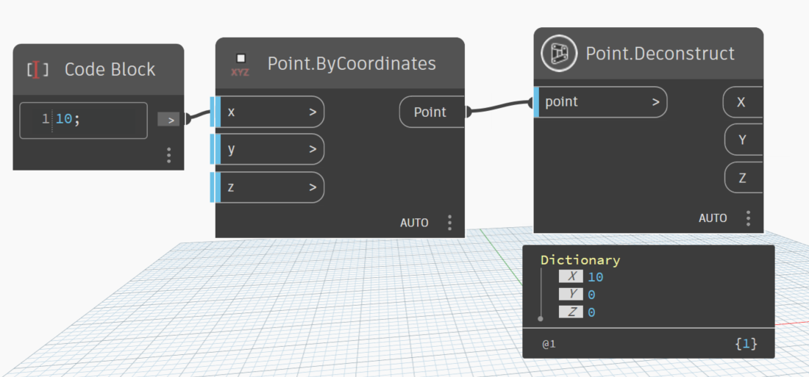

# Point

```{contents}

```

## ProjectOntoPlane

```xml
/// <summary>
/// Project a point onto a plane
/// </summary>
/// <param name="point">point need to project</param>
/// <param name="planeNormal">vector normal of plane</param>
/// <returns name="point">new point projected on plane</returns>
```

`Example` :


[ProjectOntoPlane.dyn](https://github.com/chuongmep/OpenMEP/blob/dev/docs/OpenMEPPage/geometry/dyn/Point.ProjectOntoPlane.dyn)

## Centroid

```xml
/// <summary>
/// Get the centroid of a list of points
/// </summary>
/// <param name="points">list of points</param>
/// <returns name="point">centroid</returns>
```


[Centroid.dyn](https://github.com/chuongmep/OpenMEP/blob/dev/docs/OpenMEPPage/geometry/dyn/Point.Centroid.dyn)

## Deconstruct

```xml
/// <summary>
///  Deconstruct a point into its components
/// </summary>
/// <param name="point">the point</param>
/// <returns name="X">X point</returns>
/// <returns name="Y">Y point</returns>
/// <returns name="Z">Z point</returns>
```



[Deconstruct.dyn](https://github.com/chuongmep/OpenMEP/blob/dev/docs/OpenMEPPage/geometry/dyn/Point.Deconstruct.dyn)

## IsOnPlane

```xml
/// <summary>Test whether a point lies on a plane.</summary>
/// <param name="point">point to check</param>
/// <param name="plane">The plane to test against.</param>
/// <param name="tolerance">Default is use 1e-6</param>
/// <returns>Returns true if point is on plane.</returns>
```


[IsOnPlane.dyn](https://github.com/chuongmep/OpenMEP/blob/dev/docs/OpenMEPPage/geometry/dyn/Point.IsOnPlane.dyn)

## IsOnLine

```xml
/// <summary>Test whether a point lies on a line.</summary>
/// <param name="point">a point to check</param>
/// <param name="line">The line to test against.</param>
/// <param name="tolerance">Default is use 1e-6</param>
/// <returns name="bool">Returns true if point is on line.</returns>
```


[IsOnLine.dyn](https://github.com/chuongmep/OpenMEP/blob/dev/docs/OpenMEPPage/geometry/dyn/Point.IsOnLine.dyn)

## IsInPolygon

```xml
/// <summary>
/// Returns whether an input point is contained within the polygon. If the polygon is not planar then the point
/// will be projected onto the best-fit plane and the containment will be computed using the projection of the polygon
/// onto the best-fit plane. This will return a failed status if the polygon self-intersects.
/// </summary>
/// <param name="point">the point</param>
/// <param name="polygon">the polygon</param>
/// <returns name="bool">true if point is in polygon</returns>
/// <exception cref="ArgumentNullException"></exception>
```


[IsInPolygon.dyn](https://github.com/chuongmep/OpenMEP/blob/dev/docs/OpenMEPPage/geometry/dyn/Point.IsInPolygon.dyn)

## Origin

```xml
/// <summary>
///     Gets a point with X,Y,Z = 0
/// </summary>
/// <returns name="point">point</returns>
```


[Origin.dyn](https://github.com/chuongmep/OpenMEP/blob/dev/docs/OpenMEPPage/geometry/dyn/Point.Origin.dyn)

## Offset

```xml
/// <summary>
/// Offset a point by a distance and a direction
/// </summary>
/// <param name="point">point to offset</param>
/// <param name="distance">distance from start point to end point</param>
/// <param name="direction">direction to direct to</param>
/// <returns name="point">new point</returns>
```


[Offset.dyn](https://github.com/chuongmep/OpenMEP/blob/dev/docs/OpenMEPPage/geometry/dyn/Point.Offset.dyn)