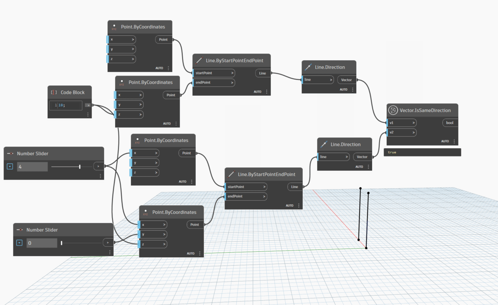
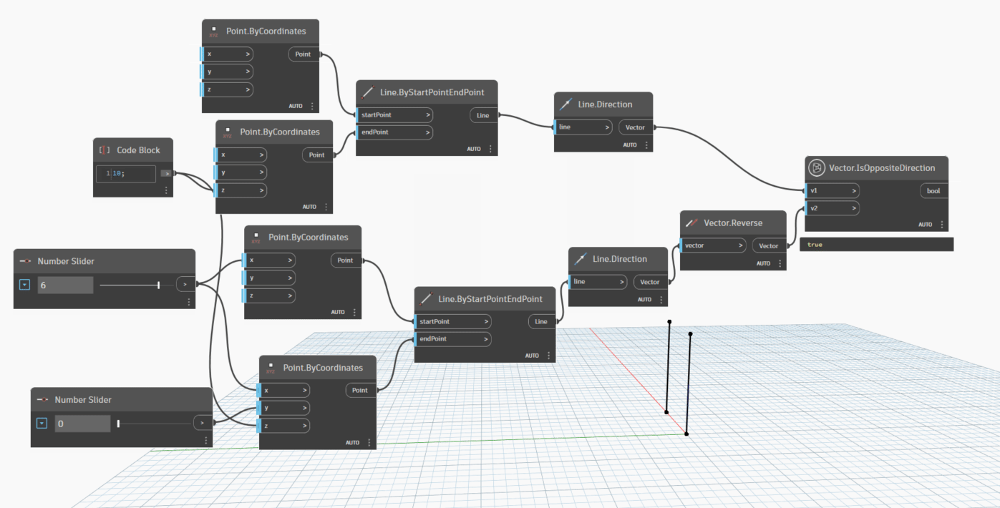

# Vector

```{contents}
```

## IsSameDirection

```xml
/// <summary>
/// Check whether two vector is same direction or not
/// </summary>
/// <param name="v1">the first vector</param>
/// <param name="v2">the second vector</param>
/// <returns name="bool">true if two vector is same direction</returns>
```



[IsSameDirection.dyn](https://github.com/chuongmep/OpenMEP/blob/dev/docs/OpenMEPPage/geometry/dyn/Vector.IsSameDirection.dyn)

## IsOppositeDirection

```xml
/// <summary>
/// Check two Vector is opposite direction or not
/// </summary>
/// <param name="v1">the first vector</param>
/// <param name="v2">the second vector</param>
/// <returns name="bool">true if two vector is opposite</returns>
```



[IsOppositeDirection.dyn](https://github.com/chuongmep/OpenMEP/blob/dev/docs/OpenMEPPage/geometry/dyn/Vector.IsOppositeDirection.dyn)
