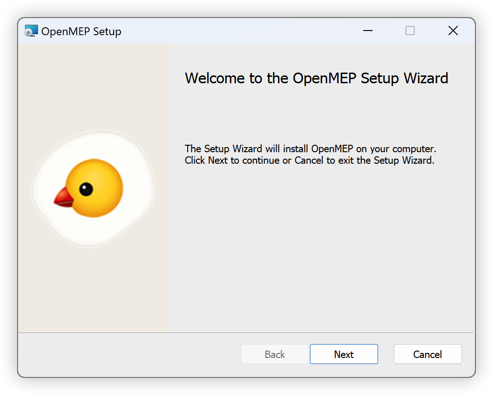

# How to upgrade OpenMEP package

With update package, now you need directly go to OpenMEP Download Latest Release to check and download new version.

- Msi : In case your computer can install at home
- Zip : In case your computer blocked by IT and can't install with msi file.(Please unzip and click msi to install)

Open user interface installer and next to install and finish

Click next to install package

Click finish to finish install package

Open Dynamo Revit and use package

