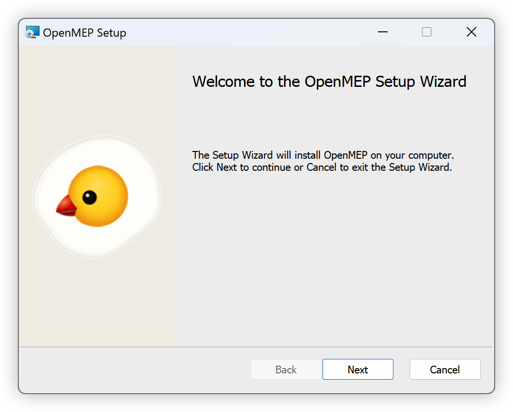

# How to install OpenMEP package

The package installer is available on the [Open MEP Release](https://github.com/chuongmep/OpenMEP/releases/latest). You
can install it from there.

- OpenMEP now Support Revit Version : 2020, 2021, 2022 , 2023
- OpenMEP now Support Dynamo Version : 2.3, 2.6, 2.12, 2.13 2.16

1. Select latest version to install package at [Latest Release](https://github.com/chuongmep/OpenMEP/releases/latest)

2. Click Msi or Zip file to download package

- Zip : In case your company blocked install msi.
- Msi : In case your computer can double click to install.

3. Open user interface installer and next to install and finish

4. Click next to install package

5. Click finish to finish install package

6. Open Dynamo Revit/Civil/Sandbox and use package

# Resolve Windows protected your PC (Business).

1. Download zip file install

2. Extract Zip file to folder :

3. Click to **MSI **file and install normal !

4. Click next to install package

5. Click finish to finish install package

6. Open Dynamo Revit/Civil/Sandbox and use package

