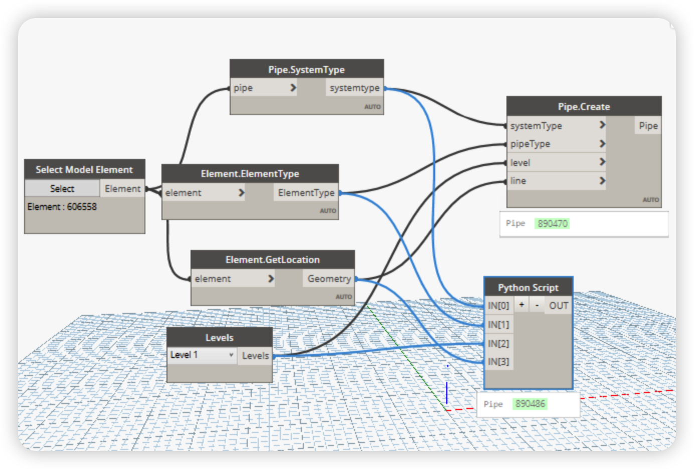

# Python Script use OpenMEP

OpenMEP allow us to use Python to create MEP elements. This is a very powerful feature that allows us to create MEP elements in a very flexible way. In this section, we will learn how to use Python to create MEP elements. To get started write python script with **OpenMEP**, we need to install OpenMEP package. OpenMEP package is available at [Latest Release](https://github.com/chuongmep/OpenMEP/releases/latest), and then let follow the instruction to install OpenMEP package at [How to install OpenMEP package](https://chuongmep.github.io/OpenMEP/tutorial/installation.html).


Now, when we open Dynamo Revit, we can see **OpenMEP** package in the library, let start with the first example. We will try import library first:

```python
# Load the Python Standard and DesignScript Libraries
import sys
import clr
clr.AddReference('OpenMEP')
import OpenMEP
from OpenMEP.Element import Duct as d

OUT =dir(d)
```


Now, let try to create a **Pipe** with Python use **OpenMEP** package.

```python

# Load the Python Standard and DesignScript Libraries
import sys
import clr
clr.AddReference('OpenMEP')
import OpenMEP
from OpenMEP.Element import Pipe as p
systemType = IN[0]
pipeType = IN[1]
level = IN[2]
line = IN[3]
OUT = p.Create(systemType,pipeType,level,line)
```




